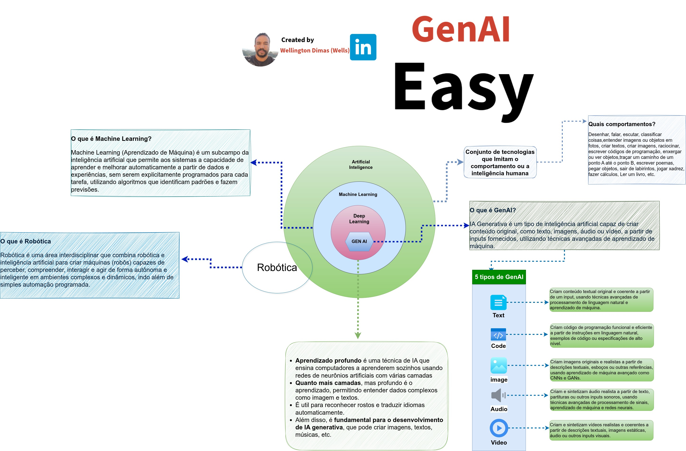

*[← Voltar ao Guia Anterior](./ia.md)*
# 🧠 Inteligência Artificial - Guia Rápido
Arquitetura:

## 📋 O que é?

Inteligência Artificial (IA) é a capacidade de máquinas realizarem tarefas que normalmente requerem inteligência humana, como aprender, raciocinar e resolver problemas.

## 🔍 Tipos de IA

- 🤖 **IA Fraca (Narrow AI)** - Especializada em tarefas específicas
- 🌐 **IA Forte (General AI)** - Inteligência comparável à humana (ainda teórica)
- 🚀 **Superinteligência** - Além da capacidade humana (futuro distante)

## 🎯 Principais Áreas

- 🗣️ **Processamento de Linguagem Natural (PLN)** - Compreensão de texto e fala
- 👁️ **Visão Computacional** - Análise de imagens e vídeos
- 🎓 **Machine Learning** - Aprendizado a partir de dados
- 🧩 **Deep Learning** - Redes neurais profundas
- 🎮 **IA Generativa** - Criação de conteúdo novo

## 💡 Aplicações Práticas

- 🏥 **Saúde** - Diagnósticos e análise de exames
- 🚗 **Transporte** - Veículos autônomos
- 💬 **Assistentes Virtuais** - Alexa, Siri, ChatGPT
- 🎬 **Entretenimento** - Recomendações personalizadas
- 🏭 **Indústria** - Automação e manutenção preditiva
- 💰 **Finanças** - Detecção de fraudes e análise de risco
- 🛒 **E-commerce** - Recomendações de produtos

## 🔧 Tecnologias Fundamentais

- 📊 **Dados** - Combustível da IA
- ⚙️ **Algoritmos** - Regras e lógica de aprendizado
- 💻 **Poder Computacional** - Processamento em larga escala
- 🎯 **Modelos Treinados** - Resultado do aprendizado

## 🌟 Benefícios

✅ Automação de tarefas repetitivas
✅ Decisões baseadas em dados
✅ Disponibilidade 24/7
✅ Processamento rápido de informações
✅ Personalização em escala

## ⚠️ Desafios e Considerações

- 🔒 **Privacidade** - Proteção de dados sensíveis
- ⚖️ **Ética** - Viés e discriminação algorítmica
- 💼 **Impacto no Trabalho** - Mudanças no mercado
- 🎓 **Transparência** - Explicabilidade das decisões

## 🚀 Futuro da IA

A IA continua evoluindo rapidamente, com avanços em:
- 🤝 IA mais colaborativa e intuitiva
- 🌍 Solução de problemas complexos globais
- 🧬 Descobertas científicas aceleradas
- 🎨 Criatividade aumentada

---

**A IA não substitui a inteligência humana, mas a complementa e amplifica.**
